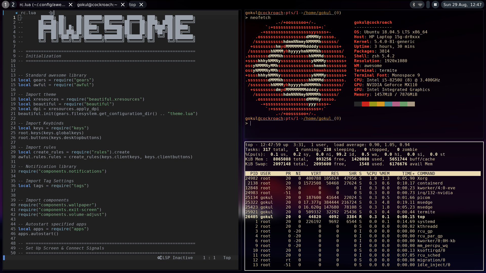

# aureole
An awesome Awesomewm rice 

 

## Contents ##
1. [Details](#details)
2. [Features](#features)
3. [Dependencies](#dependencies)
4. [Installation](#installation)
5. [Folder Structure](#folderStructure)
6. [My Preferred Applications](#applications)
7. [Keybinds](#keybinds)
8. [Notes](#notes)
9. [Gallery](#gallery)

<a name="details"></a>
## Details ##
+ **OS**: Ubuntu 18.04
+ **Shell**: ZSH
+ **WM**: awesome
+ **Terminal**: Termite

<a name="features"></a>
## Features ##
+ Super lightweight
+ Supports multi monitor setups!
+ Automatic dpi / resolution scaling
  + Note that xft.dpi must be properly assigned in the .Xresources file if you are using a high DPI screen
+ Easy installation and configuration
+ Minimal Dependencies
+ Wallpaper auto-blur 
+ Exit screen
+ Borders around active window
+ Taglist shows only active workspace and not empty ones
+ Lock screen (via `slock`)
+ Very stable :) Built off awesome 4.3 release, no bleeding edge git versions required here!

<a name="dependencies"></a>
## Dependencies ##
All possible efforts have been taken to limit the amount of dependencies by utilising the Awesome API (see [Installation section](#installation)). Here are the dependencies:

|Dependency|Description|
|:----------:|:-------------:|
|`awesome`|Window manager|
|`picom`|Window compositor|
|`rofi`|Application launcher|
|`slock`|Lock screen|
|`imagemagick`|**OPTIONAL BUT NEEDED IF USING A DIFFERENT BACKGROUND**, used in config to generate blurred wallpaper|

### Optional Dependencies ###

|Dependency|Description|
|:----------:|:-------------:|
|`acpi`|Battery management cli application|
|`xfce4-power-manager`|Power manager|
|`blueman`|Bluetooth managing application|
|`nm-connection-editor`| GUI wifi connection editor|
|`alsa-utils`|Provides kernel driven sound drivers|


<a name="installation"></a>
## Installation ##
1. Ensure all [dependencies](#dependencies) are met
2. Clone this repository and place its contents as follows:
   a. all the files other than the `rofi` folder goes into the `awesome` folder which is present in your .config
   b. place the contents of `rofi` into your `rofi` folder(generally located in `~/.config`

Or, if you are lazy, just copy paste the following :P
```
git clone https://github.com/gokulp01/aureole
cp aureole/* ~/.config/awesome
rm -rf aureole  
cd ~/.config/awesome
mv rofi ../
```
3. optional: navigate to the `awesome/wallpaper` folder and place your desired wallpaper there, ensuring that it is named `wallpaper`. One  awesome (pun intended) feature of my config is that the filetype of the wallpaper can be any image filetype and it will automatically recognize it. Remember to delete the `blurredWallpaper` file in order to make the blurring script recognize a new wallpaper has been added and needs to be blurred 
4. optional: edit the `apps.lua` file to define your desired default and startup applications
5. optional: edit the `keys.lua` file to change / add keybinds

Restart Awesome. Generally, the keybinding is `mod4+ctrl+r`

<a name="folderStructure"></a>
## Awesome Folder File Structure ##
In order to avoid a poorly organized `rc.lua` spanning thousands of lines, it has been split into multiple files / folders:
+ `rc.lua`: Script that runs when awesome starts (essentially links all the other files together)
+ `apps.lua`: Default and startup applications
+ `keys.lua`: Keybinds
+ `rules.lua`: Window rules
+ `theme.lua`: Theme variables
+ `tags.lua`: Tag information
+ `icons`: Icons used in WM
+ `components`: Components of the WM, such as panels, volume and brightness sliders, notification pop-ups, etc
+ `widgets`: Widgets used in the functionality of the components
+ `wallpaper`: Wallpaper and its blurred varient is generated / stored

<a name="applications"></a>
## My Preferred Applications ##
+ **Text Editor - LunarVim:** Really cool variant of NVim. Make sure to check it out!
+ **File Manager - PCManFM** 
+ **Archive Manager - File-roller**: It just works :)
+ **Web Browser - edge** 
+ **Terminal - Termite**: High time I switch ;_;


<a name="keybinds"></a>
## Keybinds ##
**Note that the modkey is set to be the Windows key. If you would like to use a different modkey check out the `keys.lua` file.**

 

<a name="notes"></a>
## Notes ##
+ [Awesome API Documentation](https://awesomewm.org/apidoc/index.html)
+ If you encounter any problems please open an issue in this repo and I will gladly investigate it


<a name="gallery"></a>
## Gallery ##


 
